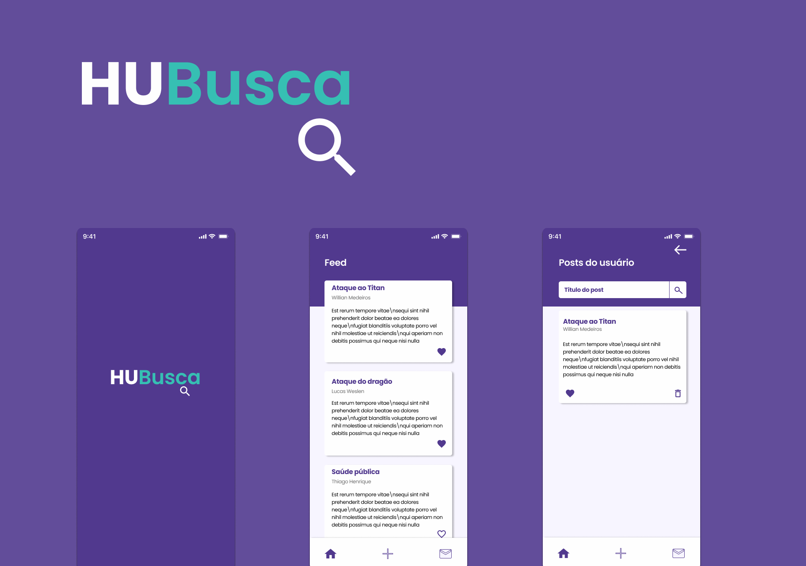

<h1 align="center">
   <br>
</h1>

<br>

<h1 align="center">
  
</h1>


## 💻 Projeto

Está aplicação foi um desafio técnico para uma vaga de React Native Junior.

O objetivo era de listar, cadastrar e excluir postagens.<br>
A api disponibilizada para consumo pode ser encontrada [aqui](https://jsonplaceholder.typicode.com/).
<br><br>


## 💬 Informações sobre as funcionalidades

### Tela Home (Feed) 🏠

- A tela home exibe todos os posts que são buscados da api;
- Nesta tela tem as possibilidade de curtir um post e exibir as informações do usuário que criou o post;
- Ao abrir a tela de informações do usuario que criou o post, tem a possibilidade de listar todos os postes criados pelo mesmo.
<br><br>

### Tela Novo Post 🆕

- Ao criar o post será exibido um modal confirmando a criação;
<br><br>

### Tela Posts do usuário ✅

- Ao realizar a criação de um novo post, para ultilizar um usuário, ultilizei um id aleatório com base nos usuários cadastrados na api, por isso o post irá possuir o nome de um usuário;
- Todos os posts criados serão exibidos nesta tela;
- Possui a possubilidade de pesquisar, excluir ou curtir um post criado; 
<br><br>

### Otras informações
- As curtidas e posts criados são amazenados no local storage.<br>

- No link Abaixo pode ser encontrado o arquivo .apk da aplicação.<br>
**[Aplicativo HUBusca](https://drive.google.com/drive/folders/1uBOBO5JOBAExjNilmcvDBbZow_upVytV?usp=sharing)**.<br>
- Este arquivo foi gerado ultilizando **[Expo](https://docs.expo.io)**. <br><br>


## 🎲 Executar aplicação
```bash
# Clone este repositório
$ git clone https://github.com/WillianMedeiros14/hubusca.git

# Entre na pasta do projeto.
$ cd hubusca

# Instale as dependências
$ yarn

# Execute a aplicação
$ expo start

```

## 🚀 Tecnologias ultilizadas

- Este app foi criado com Bare Workflow, o qual possibilita criar aplicações **[React Native](https://reactnative.dev/)**, utilizando tanto as funcionalidades nativas do React Native como também as do **[Expo](https://docs.expo.io)**.
- As estilizações foram criadas com **[Styled Components](https://styled-components.com/)**.
- As requisições da api foram feitas ultilizando **[Axios](https://github.com/axios/axios)**.
